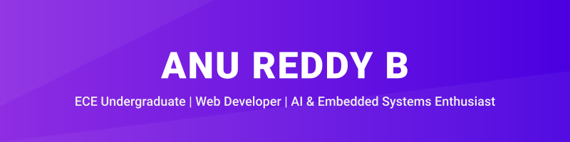

 
 

**ECE Undergraduate @ Vidya Vardhaka College of Engineering, Mysuru** 
Architecting intelligent solutions at the intersection of AI, Web, and IoT.

 
 

---

### ✦ About Me

I am a passionate developer with a strong foundation in Electronics and Communication Engineering. My focus lies at the intersection of hardware and software, leveraging modern technologies to build practical, real-world solutions. 

**Currently focused on:**
- 🧠 Building AI-powered applications
- 🔌 Exploring Embedded Systems and IoT
- 💻 Learning Full-Stack Development
- 🛠️ Developing real-world problem-solving projects

---

### ✦ Technology Stack

#### Programming

#### Frontend

#### Backend & Databases

#### Embedded Systems & IoT

#### Tools, Cloud & AI

---

### ✦ Featured Projects

<table bordercolor="#66b2b2">
  <tr>
    <td width="33%" valign="top">
      <h3 align="center">📡 FestFlow</h3>
       
      
The ultimate synergy of IoT hardware and real-time analytics for next-generation festival safety.

       
      

        🔗 <a href="https://github.com/anureddyb20/Fest-Flow">github.com/anureddyb20/Fest-Flow</a>
      

    </td>
    <td width="33%" valign="top">
      <h3 align="center">🤝 CollabNest</h3>
       
      
A collaborative platform connecting people with ideas to people with skills for meaningful project collaboration.

       
      

        🔗 <a href="https://github.com/anureddyb20/collabnest">github.com/anureddyb20/collabnest</a>
      

    </td>
    <td width="33%" valign="top">
      <h3 align="center">🍃 VayuCool</h3>
       
      
An interactive urban thermal experience designed for environmental temperature analysis.

       
      

        🔗 <a href="https://github.com/anureddyb20/Vayucool">github.com/anureddyb20/Vayucool</a>
      

    </td>
  </tr>
</table>

---

### ✦ GitHub Analytics

  
  

---

### ✦ Connect With Me

  
  &nbsp;&nbsp;
  
  &nbsp;&nbsp;
  

 

  <i>Let's build something amazing together.</i>

